# 基于UE4的动作捕捉系统

19307130253 杨秀华

## 背景介绍

动作捕捉，通常是指在3D游戏或动画中，通过传感器和软件，把真人演员的动作转录成数字模型的动作。众所周知，动画和游戏中的角色（包括人物和动物）必须要有动作，比如奔跑、跳跃、打斗等等。在动作捕捉技术出现之前，这些动作都是需要人工一帧一帧画上去的。无论是2D还是3D，动画还是游戏，都要求动画师/动作师根据感觉和经验，一点一点手调关键帧，把角色的动作逐帧模拟出来。

这种生产方式的缺点很明显，过于依赖动画师的个人素质，不同层次的动画师做出来的动作天差地别，导致产品的成本和质量基本处于不可控状态。为了解决以上问题，动作捕捉技术应运而生。

## 技术路线

### 人体建模

这部分无需自行建模，直接采用UE4的第三人称游戏初始化出来的机器人即可：

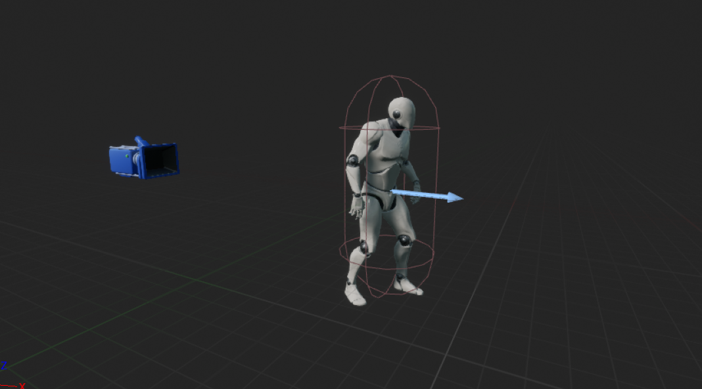

### 姿态识别插件

姿态识别算法采用mediapipe库实现，如下是一个用python实现的使用mediapipe库的实例：

PoseModule.py

```python
import cv2
import mediapipe as mp
import time


class PoseDetector:

    def __init__(self, mode=False, upBody=False, smooth=True, detectionCon=0.5, trackCon=0.5):

        self.mode = mode
        self.upBody = upBody
        self.smooth = smooth
        self.enable_segmentation=False
        self.detectionCon = detectionCon
        self.trackCon = trackCon

        self.mpDraw = mp.solutions.drawing_utils
        self.mpPose = mp.solutions.pose
        self.pose = self.mpPose.Pose(self.mode, self.upBody, self.smooth, self.enable_segmentation, self.detectionCon, self.trackCon)

    def findPose(self, img, draw=True):
        imgRGB = cv2.cvtColor(img, cv2.COLOR_BGR2RGB)
        self.results = self.pose.process(imgRGB)
        # print(results.pose_landmarks)
        if self.results.pose_landmarks:
            if draw:
                self.mpDraw.draw_landmarks(
                    img, self.results.pose_landmarks, self.mpPose.POSE_CONNECTIONS)

        return img

    def getPosition(self, img, draw=True):
        lmList = []
        if self.results.pose_landmarks:
            for id, lm in enumerate(self.results.pose_landmarks.landmark):
                h, w, c = img.shape
                #print(id, lm)
                cx, cy = int(lm.x * w), int(lm.y * h)
                lmList.append([id, cx, cy])
                if draw:
                    cv2.circle(img, (cx, cy), 5, (255, 0, 0), cv2.FILLED)
        return lmList


def main():
    cap = cv2.VideoCapture('videos/1.mp4')  # make VideoCapture(0) for webcam
    pTime = 0
    detector = PoseDetector()
    while True:
        success, img = cap.read()
        img = detector.findPose(img)
        lmList = detector.getPosition(img)
        print(lmList)

        cTime = time.time()
        fps = 1 / (cTime - pTime)
        pTime = cTime

        cv2.putText(img, str(int(fps)), (50, 50),
                    cv2.FONT_HERSHEY_SIMPLEX, 1, (255, 0, 0), 3)
        cv2.imshow("Image", img)
        cv2.waitKey(1)


if __name__ == "__main__":

    main()
```

Test.py

```python
import cv2
import time
import PoseModule as pm

cap = cv2.VideoCapture(0)
pTime = 0
detector = pm.PoseDetector()
while True:
    success, img = cap.read()
    img = detector.findPose(img)
    lmList = detector.getPosition(img)
    print(lmList)

    cTime = time.time()
    fps = 1 / (cTime - pTime)
    pTime = cTime

    cv2.putText(img, str(int(fps)), (50, 50), cv2.FONT_HERSHEY_SIMPLEX, 1, (255, 0, 0), 3)
    cv2.imshow("Image", img)
    cv2.waitKey(1)
```

运行示例：

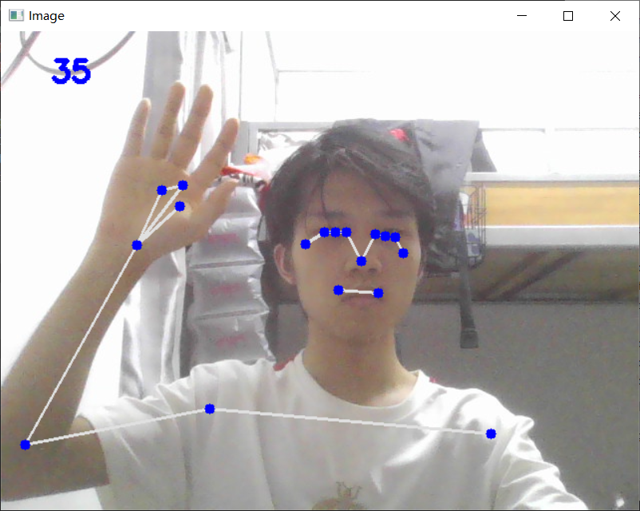

由于UE4采用C++实现，可以直接采用UE4的mediapipe插件，然后将opencv动态库`opencv_world3410`下载到`Binary`目录下一同编译：

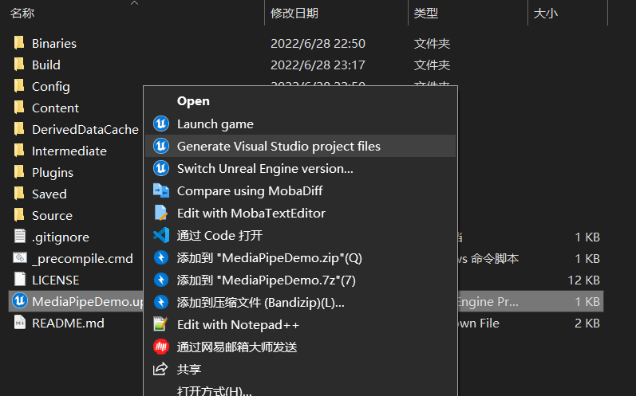

### 制作动画蓝图

#### MP_Pipeline

MP_Pipiline定义了mediapipe插件的所有基本事件，包括开始与停止抓捕视频流，设置节点位置，绘制坐标等：

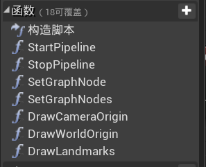

蓝图如下：

##### StartPipeline

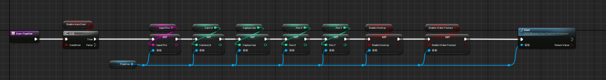

##### StopPipeline

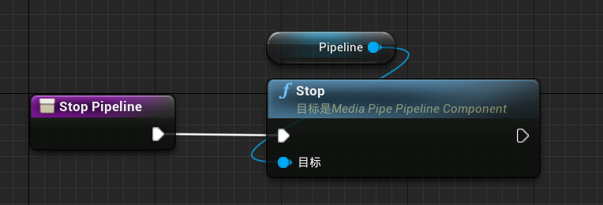

##### SetGraphNode

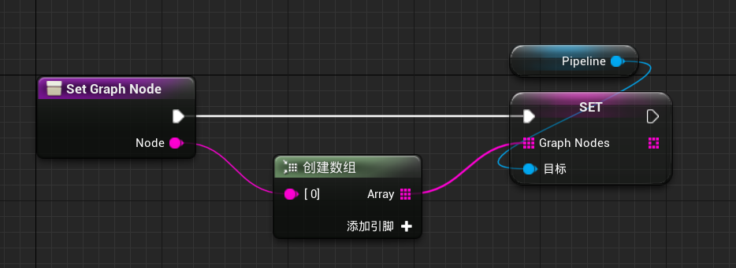

##### SetGraphNodes

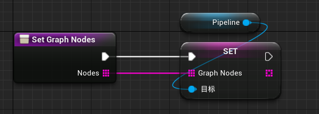

##### DrawCameraOrigin

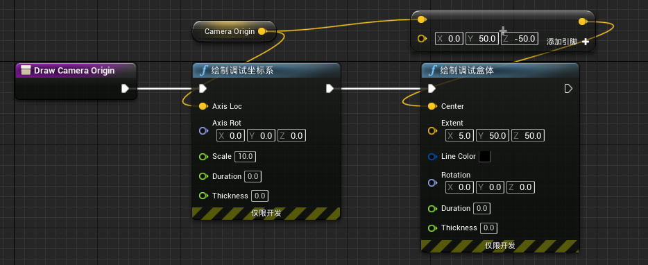

##### DrawWorldOrigin

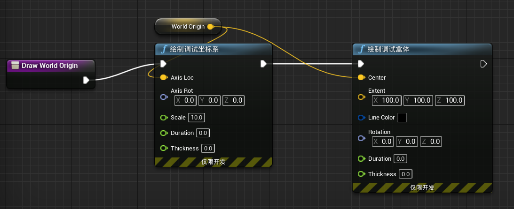

##### DrawLandmarks

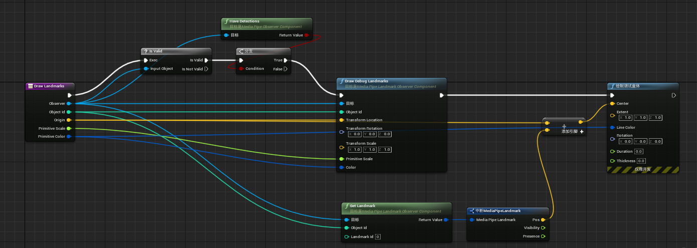

#### MP_PuppetAvatar

该类是MP_Pipeline的子类，作用是将节点的坐标与机器人的骨骼绑定：

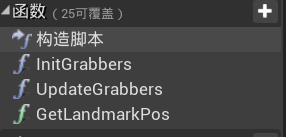

蓝图如下：

##### InitGrabbers

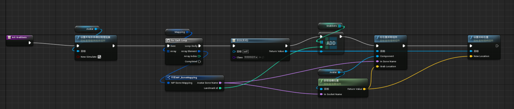

##### UpdateGrabbers

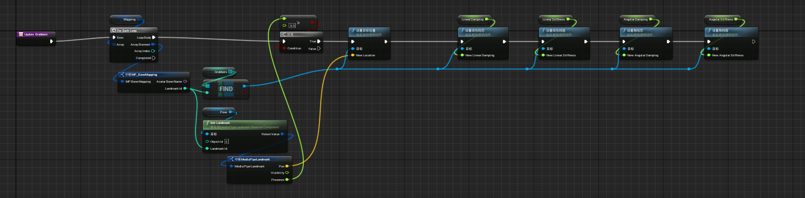

##### GetLandmarksPos

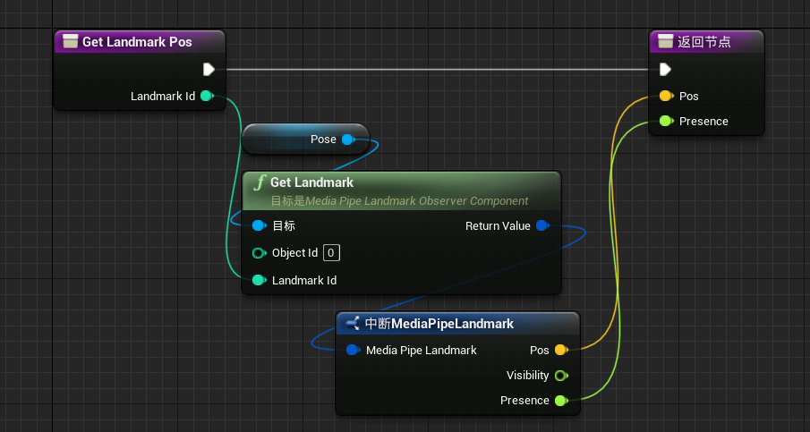

事件运行图表：

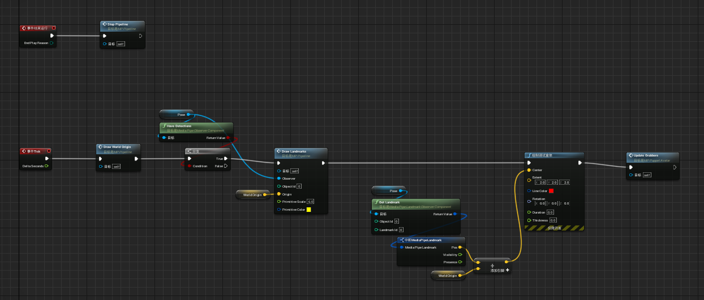

当关卡开始运行时，mediapipe插件绘制LandMarks并由MP_PuppetAvatar类获取，用来更新骨骼的位置。

## 总结

由于调试本项目花去过多时间，仍然没有达到很理想的效果，有很多细节还没有完善，比如手掌，脚掌和头部部分还不够精细，未来我会继续完善本系统，并且会加上面部表情的捕捉功能以及自定义人物模型。